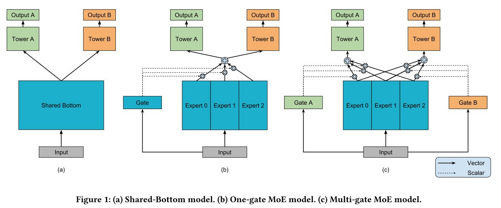
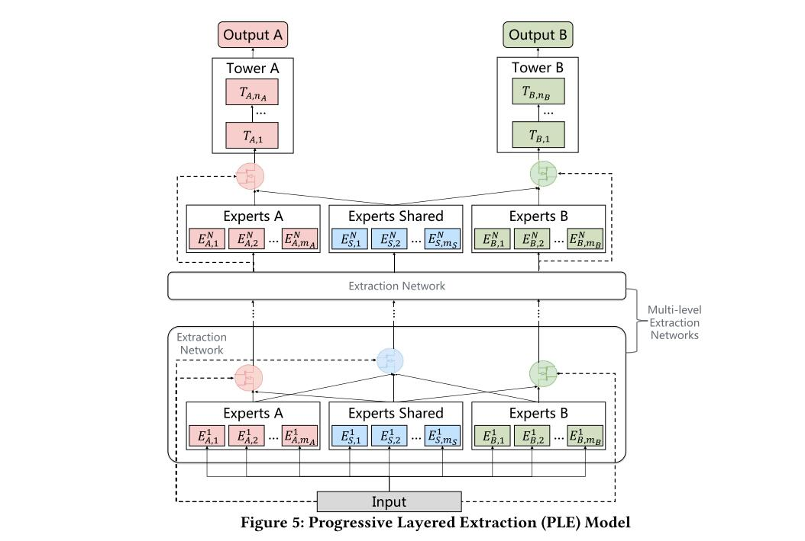

# 推荐系统中的多目标算法

     

### 简介

- 实现推荐系统中的排序算法，使用多任务模型与多任务优化算法并公开数据集评测。
- 使用[微信视频号推荐算法比赛](https://algo.weixin.qq.com/problem-description)数据集

- 为了贴合工业界使用情况，使用`TensorFlow Estimator`框架，数据形式为`Tfrecord`；

### 数据集说明

- 数据集原始文件为 `user_action.csv` `feed_info.csv`
- `EDA.ipynb`为数据探索结果；
- `DataGenerator.py`为ETL脚本，生成数据集：训练集3322313条，测试集6069037条，特征工程逻辑请见`DataGenerator.py`头部注释。

数据集生成的目录结构如下：

```
├── dataframe
│   ├── DATAFRAME_ALREADY
│   ├── test.csv
│   └── train.csv
├── DataGenerator.py
├── EDA.ipynb
├── features
│   ├── cross_agg_features.pkl
│   ├── FEATURES_PKL_ALREADY
│   ├── feed_agg_features.pkl
│   ├── user_agg_features.pkl
│   └── user_seq_features.pkl
├── feed_info.csv
├── tfrecord
│   ├── test.tfrecord
│   ├── TFRECORD_ALREADY
│   └── train.tfrecord
├── user_action.csv
└── vocabulary
    ├── authorid.txt
    ├── bgm_singer_id.txt
    ├── bgm_song_id.txt
    ├── device.txt
    ├── feedid.txt
    ├── manual_tag_id.txt
    ├── userid.txt
    └── VOCAB_FILE_ALREADY
```

- `dataframe` `features` 文件夹内为ETL中间结果
- `vovabulary`文件夹内为各个类别特征的词典
- `tfrecord`文件夹内为最终生成的训练集和测试集

数据集处理参考自：https://github.com/tangxyw/RecAlgorithm

### 多任务Models列表

#### 1. MMOE：Google KDD2018

这篇文章提出后就成为CTR领域的MTL标配了。MMOE模型在多任务之间相关性较低的时候，效果也能表现得很不错。



#### 2. PLE ：Tencent RecSys 2020

此模型是对MMOE的改进，结构简洁，效果显著。它在MMOE的基础上，为每个任务添加了自己的specific expert。在不同相似度的任务上，PLE都表现优异。



#### 3. ESMM：SIGIR 18


#### 4. CTnoCVR


#### 多任务Models在数据集上的运行结果

|  Model  |                            Paper                             | Best_read_commet_AUC | Best_like_AUC | Best_click_avatar_AUC |
| :-----: | :----------------------------------------------------------: | :------------------: | :-----------: | :-------------------: |
|  ESMM   | [2018] [Entire Space Multi-Task Model: An Effective Approach for Estimating Post-Click Conversion Rate](https://arxiv.org/abs/1804.07931) |          -           |       -       |           -           |
|  MMOE   | [2018] [Modeling Task Relationships in Multi-task Learning with Multi-gate Mixture-of-Experts](https://dl.acm.org/doi/abs/10.1145/3219819.3220007) |                      |               |                       |
|   PLE   | [2020] [Progressive Layered Extraction (PLE): A Novel Multi-Task Learning (MTL) Model for Personalized Recommendations](https://dl.acm.org/doi/10.1145/3383313.3412236) |                      |               |                       |
| CTnoCVR | [2022] CTnoCVR: A Novelty Auxiliary Task Making the Lower-CTR-Higher-CVR Upper |                      |               |                       |


### 多任务多目标优化策略


### 多任务模型融合

通过对多种模型的差异性融合，提高模型的稳定性，获取相比与当模型更高的收益